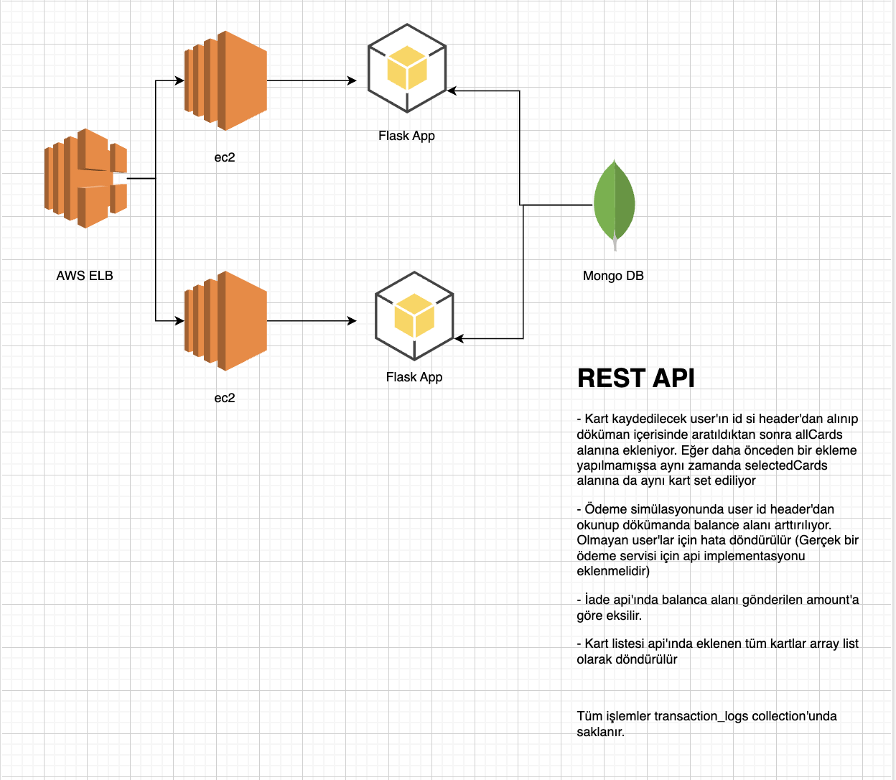

## 🚀 Hergele Backend Case Study
Bu repo, Docker ve Gunicorn ile çalıştırılabilen basit bir Flask uygulamasını içermektedir.

Projeyi yerel makinenizde nasıl çalıştıracağınıza dair adımlar bulunmaktadır.

### 📋 Önkoşullar

- Docker'ın kurulu olması gerekmektedir. [Docker'ı buradan indirebilirsiniz.](https://www.docker.com/products/docker-desktop)

### Kurulum

1. Repoyu klonlayın:
   ```bash
   git clone https://github.com/denizparlak1/CaseStudy.git
   cd CaseStudy

2. Docker image'ını oluşturunü
   ```bash
   docker build -t case-app .
   docker run -e MONGO_URI="mongodb+srv://<user>:<passwd>@<mongo-cluster-url>/<db>?retryWrites=true&w=majority" -p 8000:8000 case-app
🌐 Uygulama şimdi http://localhost:8000 adresinde çalışıyor olmalıdır.

### API İstekleri
API'nizi test etmek için Postman Collection'ı kullanabilirsiniz. Bu collection, API'nin tüm endpoint'lerini ve bu endpoint'lere nasıl istek atılacağını içermektedir.

Postman Collection Kullanımı:
Postman uygulamasını indirin ve kurun.
Uygulamayı açın ve "Import" butonuna tıklayın.
İndirdiğiniz Postman Collection dosyasını seçin ve import edin.
Sol tarafta, import ettiğiniz collection'ı görebilirsiniz. Bu collection içerisinde, tüm API endpoint'lerini ve bu endpoint'lere nasıl istek atılacağını bulabilirsiniz.
İstediğiniz bir request'i seçin ve "Send" butonuna tıklayarak isteği gönderin.

Postman Collection'ını docs klasöründe bulabilirsiniz. Bu collection, uygulamanın tüm endpoint'lerini ve nasıl kullanılacağını gösteren örnek istekleri içermektedir.
[Postman Collection](./docs/Case.postman_collection.json)


1. Deploy edilmiş demo URL;
   ```bash
   http://13.51.146.64:8000
   
### 🏗 Mimari Şema
Bu projede kullanılan mimari, modern web uygulamalarının gereksinimlerini karşılamak üzere tasarlanmıştır. Şemada görebileceğiniz üzere, uygulama Docker üzerinde çalışmaktadır, bu sayede platformdan bağımsız olarak kolayca dağıtılabilir ve ölçeklenebilir. Gunicorn, uygulamanın WSGI sunucusu olarak hizmet verirken, Flask ise web framework olarak kullanılmıştır. Veritabanı bağlantısı için MongoDB kullanılmıştır ve bu bağlantı, uygulama içerisinden bir ortam değişkeni ile sağlanmaktadır.
Performans ve güvenlik geliştirmeleri case çalışması dahilinde ön planda tutulmamıştır.



